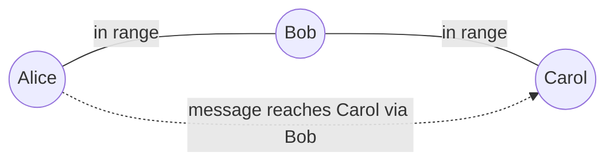
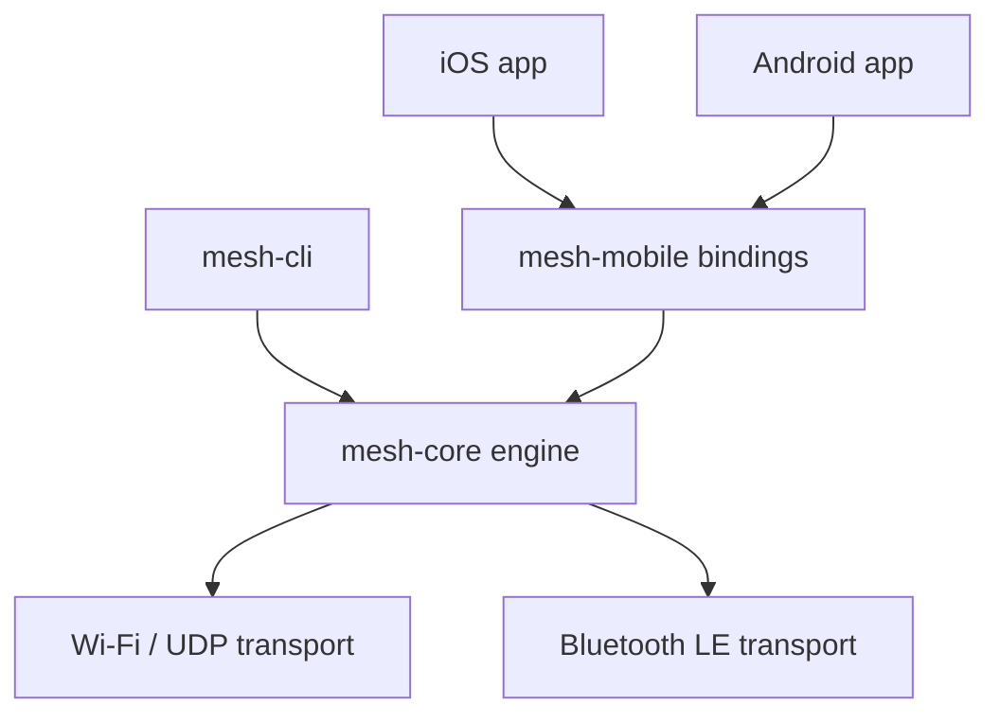

# meshtalk

Chat that works with **no internet and no cellular signal**. Devices relay messages for
each other, hop by hop, so two people out of range of each other can still talk as long
as there's an unbroken chain of devices between them.



Alice and Carol are never directly connected -- Bob relays for them automatically. This
works whether "in range" means a meter (Bluetooth) or a kilometer (LoRa), and with any
number of hops in between.

This is a real mesh-networking engine, not a wrapper around a cloud API. The hard part is
the routing layer: flood routing with a hop-count budget, message de-duplication, and
end-to-end encryption that survives being relayed through devices that aren't the sender
or the recipient.

## How it works



- **`mesh-core`** -- the engine. Doesn't know or care what radio it's running on.
  - *Identity*: every device has a keypair; messages are signed so a relay can't forge them.
  - *Encryption*: a shared passphrase encrypts messages -- like tuning into the same radio channel.
  - *Routing*: every device that gets a new message re-sends it to its own neighbors (and
    decrements a hop-count budget so messages don't loop forever). That's what makes the
    relay chain above work, like a bucket brigade.
- **Transports** -- swappable radios behind one `Transport` interface. Today: Wi-Fi/UDP
  (fully working) and Bluetooth LE (partial, see Status). Planned: Wi-Fi Direct, LoRa.
- **LAN auto-discovery** -- devices on the same Wi-Fi network find each other automatically
  (UDP broadcast), no IP address typing needed. Each pair also gets a short 6-digit code,
  identical on both screens, so you can visually confirm you're connecting to the right
  device -- the same idea as Bluetooth's numeric-comparison pairing.
- **`mesh-mobile`** -- exposes the engine to Swift (iOS) and Kotlin (Android) apps.

```
crates/
  mesh-core/           the engine: identity, crypto, routing, message store
  mesh-transport-udp/  Transport impl over Wi-Fi/UDP (works today)
  mesh-transport-ble/  Transport impl over Bluetooth LE (partial, see Status)
  mesh-mobile/         UniFFI bindings exposing mesh-core to Swift (iOS) and Kotlin (Android)
  mesh-cli/            terminal demo client
```

## Status

| Piece | State |
|---|---|
| Core engine (routing, crypto, identity) | Working, try the demo below |
| Wi-Fi / UDP transport | Working |
| LAN auto-discovery + pairing codes | Working -- verified two devices find each other and get matching codes with no IP entry |
| File attachments (image / video / voice note) | Working -- chunked so any file size flows through the same relay path; verified a 150KB attachment reassembles byte-for-byte |
| Addressed (per-contact) messaging | Working -- messages/attachments target one specific peer instead of a shared broadcast, so each connected device gets its own private thread |
| Per-contact chat UI (mobile apps) | Working -- WhatsApp-style conversation list (one card per connected device, with online/offline status and a last-message preview), tapping a card opens that person's own thread |
| Voice & video calling (mobile apps) | Working -- live mesh-relayed calls with ringing/accept/reject/hang-up signaling, real audio capture+playback, and video capture where camera hardware is available; verified live in the iOS Simulator, including multi-hop relay of call signaling and media frames |
| Bluetooth LE transport | Can scan + connect; can't yet be discovered by others (needs platform-specific work per OS, see [Roadmap](#roadmap)) |
| iOS app | Runs in the iOS Simulator -- conversation list, per-contact chat threads, and voice/video calling all verified live via screenshots on two simulators talking to each other |
| Android app | Builds and genuinely links the engine, with UI mirroring the iOS app (conversation list, per-contact threads, calling); not yet run on an emulator/device |

## Try the relay demo (3 nodes, no real radios needed)

This simulates three people in a line, 1 hop apart, where the two end nodes are **not**
directly reachable — the middle node relays for them.

```bash
cargo build --release

# terminal 1 (alice can only reach bob)
./target/release/mesh-cli --name alice --listen 127.0.0.1:9001 --peers 127.0.0.1:9002

# terminal 2 (bob can reach both alice and carol -- the relay)
./target/release/mesh-cli --name bob --listen 127.0.0.1:9002 --peers 127.0.0.1:9001,127.0.0.1:9003

# terminal 3 (carol can only reach bob)
./target/release/mesh-cli --name carol --listen 127.0.0.1:9003 --peers 127.0.0.1:9002
```

Type a message in alice's terminal and it will show up in carol's terminal, relayed
through bob, even though alice and carol never talk to each other directly.

## Auto-discovery and pairing (no IP address typing)

Instead of manually entering a peer's IP address, `mesh-transport-udp` broadcasts a small
announcement over the local Wi-Fi network and listens for others -- like Bluetooth/Wi-Fi
device discovery. Each discovered device also gets a short 6-digit code, computed
identically on both sides from the two devices' node IDs, so you can visually confirm
you're pairing with the right device before connecting (the same idea as Bluetooth's
numeric-comparison pairing) -- see `crates/mesh-transport-udp/src/discovery.rs`.

Try it with two terminals:

```bash
cargo run -p mesh-transport-udp --example discovery_demo -- alice
cargo run -p mesh-transport-udp --example discovery_demo -- bob
```

Each side prints the other's name, address, and pairing code -- both should show the
*same* code. The mobile apps' Settings screens use this instead of a manual IP field:
nearby devices just show up with a "Connect" button.

## File attachments (images, video, voice notes)

Messages aren't limited to text. `mesh-core` splits any attachment into small chunks
(1KB each -- see `crates/mesh-core/src/payload.rs` for why: larger chunks were silently
dropped over UDP in testing, likely an MTU/fragmentation issue) that flow through the
exact same signed/encrypted/relayed path as a text message, and reassembles them on the
other end (`crates/mesh-core/src/reassembly.rs`) once every chunk has arrived.

Both apps' Chat screens have a paperclip button (photo/video picker) and a mic button
(voice note recorder) alongside the text field. Large attachments -- especially video --
are less likely to arrive complete over many hops, since the mesh has no retransmission;
this works best for photos and short voice notes today.

Verified with `crates/mesh-mobile/swift-tests/file_transfer_smoke_test.swift`: sends a
150KB attachment (split into ~150 chunks) between two `MeshClient`s and confirms the
reassembled bytes match the original exactly, byte-for-byte.

## Per-contact chat (multiple conversations)

Early on, every message was a broadcast: anything you sent went out to every connected
device, and every device saw the same single shared chat feed -- fine for a demo, not how
a real chat app works once more than one contact is connected.

Messages are now addressed to one specific peer, the same way calls already were:
`Chunk` (the wire format for both text and file attachments, see
`crates/mesh-core/src/payload.rs`) carries a `target: Option<NodeId>` -- `None` means
broadcast (kept only so `mesh-cli`'s terminal demo still works unchanged), `Some(NodeId)`
means a direct message to exactly one device. Every relay still forwards the envelope
regardless of who it's addressed to (multi-hop reachability is unaffected), but only the
intended recipient surfaces it to their own UI (`MeshNode::handle_incoming` in
`crates/mesh-core/src/node.rs`).

Both mobile apps' Chat tab is a conversation list -- one card per connected device (like
WhatsApp), showing an avatar, the device's display name, an online/offline dot, and a
preview of the last message exchanged with just that person. Tapping a card opens that
person's own thread (`ChatThreadView.swift` / `ChatThreadScreen.kt`), showing only the
messages exchanged with them, with their online/offline status and voice/video call
buttons right in the header. The Settings screen's nearby-devices list also has a direct
chat-icon shortcut into a peer's thread alongside its call buttons.

## Mobile bindings (Swift / Kotlin)

`mesh-mobile` exposes `mesh-core` to Swift and Kotlin via [UniFFI](https://mozilla.github.io/uniffi-rs/),
using the UDP transport under the hood today (works over any shared Wi-Fi/hotspot; BLE
will be swappable in once its peripheral/advertising side lands -- see Roadmap).

Generate the Swift bindings from the compiled library and run the checked-in smoke tests
(`smoke_test.swift` relays a message between two `MeshClient`s exactly like the CLI demo
above; `discovery_smoke_test.swift` additionally proves auto-discovery, matching pairing
codes, and one-tap connect via `addPeer` -- all through the real Swift API):

```bash
cargo build -p mesh-mobile
cargo run -p mesh-mobile --features uniffi-bindgen --bin uniffi-bindgen -- \
  generate --library target/debug/libmesh_mobile.dylib --language swift --out-dir bindings/swift

cp crates/mesh-mobile/swift-tests/smoke_test.swift /tmp/main.swift
swiftc \
  -Xcc -fmodule-map-file="$(pwd)/bindings/swift/mesh_mobileFFI.modulemap" \
  -I bindings/swift -L target/debug -lmesh_mobile \
  bindings/swift/mesh_mobile.swift /tmp/main.swift -o /tmp/test_mesh
DYLD_LIBRARY_PATH=target/debug /tmp/test_mesh
```

(Swap in `crates/mesh-mobile/swift-tests/discovery_smoke_test.swift` for the
auto-discovery/pairing test.) Swift only allows top-level executable code in a file
literally named `main.swift`, hence the copy step. Kotlin bindings work the same way with
`--language kotlin`.

## Voice & video calling

Calls use the same addressed-messaging pattern as chat: `AddressedCall { target: NodeId }`
(`crates/mesh-core/src/call.rs`) carries invite/accept/reject/end signaling and media
frames to one specific peer over the mesh, relayed hop-by-hop like everything else. A
few things needed extra care versus the happy path:

- **Signal reliability**: accept/reject/end signals are sent with retries (3x, 200ms
  apart) since a single dropped UDP packet shouldn't leave the other side stuck ringing
  forever or unaware a call ended. Invite signals are deliberately *not* retried, to avoid
  duplicate rings or spurious auto-declines.
- **Frame ordering**: call frames are sent synchronously rather than spawned onto worker
  threads, since audio/video frame order matters and spawned tasks can otherwise race
  and arrive out of sequence.
- **Media capture/playback**: `CallAudioEngine` (iOS/Android) captures and plays back
  microphone audio in real time; `CallVideoCapture` captures camera frames where hardware
  is available and shows a clear "No camera" / "Waiting for video..." placeholder
  otherwise (e.g. the iOS Simulator has no camera).

Both mobile apps show phone/video call buttons next to a connected peer in Settings and
in that peer's own chat thread. Verified live in the iOS Simulator with two devices:
ringing, accept, active call (audio + placeholder video), mute, hang-up, and
call-cancellation while still ringing all worked correctly across the mesh relay path.

## iOS app

`ios/` contains a SwiftUI app (`MeshTalk`) wrapping `mesh-mobile`: a Chat tab (WhatsApp-
style conversation list -- one card per connected device with online status and a last-
message preview -- that opens into a per-contact thread with its own call buttons) and a
Settings tab. Nearby devices on the same Wi-Fi network show up automatically with a
pairing code and a "Connect" button -- no manual IP entry needed (a manual `IP:port`
field is still there under "Advanced" as a fallback). No BLE auto-discovery yet across
networks (see Roadmap).

The Xcode project itself (`ios/MeshTalk.xcodeproj`) is generated by
[XcodeGen](https://github.com/yonaskolb/XcodeGen) from `ios/project.yml`, and the Rust
library is packaged as an XCFramework -- neither is committed to git since both are
build artifacts. Regenerate everything with:

```bash
brew install xcodegen   # one-time
rustup target add aarch64-apple-ios-sim   # one-time
./scripts/build-ios.sh sim
```

This builds `mesh-mobile` for the iOS Simulator, generates Swift bindings, packages the
XCFramework, and runs XcodeGen. Then either open `ios/MeshTalk.xcodeproj` in Xcode, or
build from the CLI (unsigned, since there's no dev team configured):

```bash
xcodebuild -project ios/MeshTalk.xcodeproj -target MeshTalk -sdk iphonesimulator \
  ARCHS=arm64 ONLY_ACTIVE_ARCH=NO CODE_SIGNING_ALLOWED=NO CODE_SIGNING_REQUIRED=NO build
```

**Status**: builds successfully, and has actually been run in the iOS Simulator (not just
compiled) -- installed and launched on an iPhone 17 Pro simulator, confirmed via
screenshot showing the Chat screen rendering correctly with the Rust engine wired up
underneath.

## Android app

`android/` contains a Jetpack Compose app mirroring the iOS one: the same WhatsApp-style
conversation list opening into per-contact threads with call buttons, and a Settings
screen with the same auto-discovery + pairing-code UX (nearby devices show up
automatically, tap "Connect" -- no manual IP entry needed), wrapping `mesh-mobile` via
UniFFI-generated Kotlin bindings and JNA.

Requires the Android SDK + NDK (only the NDK's clang is needed as the linker; nothing
Android-specific is compiled from C/C++ otherwise) and JDK 17 (AGP doesn't yet support
newer JDKs like 25). One-time setup and build:

```bash
brew install --cask android-commandlinetools
export ANDROID_HOME=/opt/homebrew/share/android-commandlinetools
yes | sdkmanager --licenses
sdkmanager --install "platform-tools" "platforms;android-34" "build-tools;34.0.0" "ndk;27.0.12077973"
rustup target add aarch64-linux-android armv7-linux-androideabi x86_64-linux-android i686-linux-android

./scripts/build-android.sh   # builds all 4 ABIs, generates Kotlin bindings, stages jniLibs

cd android
JAVA_HOME=$(/usr/libexec/java_home -v 17) ./gradlew assembleDebug
```

**Status**: `BUILD SUCCESSFUL` -- the APK genuinely packages `libmesh_mobile.so` for all
4 ABIs (verified with `llvm-nm`) -- it just hasn't been installed on an emulator/device
yet (no AVD was set up in this environment).

## Roadmap

1. Real short-range radio transports: Bluetooth LE and Wi-Fi Direct (mobile), LoRa
   (long-range, low-bandwidth) for text/telemetry. BLE central role (scan + connect)
   works today via [`btleplug`](https://docs.rs/btleplug); peripheral/advertising mode
   (needed so a device can be *found*) needs native platform code per OS -- see the repo
   issue tracker for the macOS/iOS, Android, and Linux follow-ups.
2. Mobile apps (iOS/Android) via the Rust core + UniFFI bindings -- see Status above.
3. Voice/video calling over Wi-Fi/UDP is working today (see [Voice & video
   calling](#voice--video-calling)); extending live calls to stay usable over many hops
   (higher latency/lower bandwidth links) and adding group calls are still open.
4. Run the Android app on an emulator/real device (currently build-verified only).
5. Optional browser client (experimental -- Web Bluetooth/WebRTC have limited/no support
   on iOS Safari, so this will always be a secondary option to the native mobile app).

## Why this matters

Built for places with no cellular signal or internet: disaster response, remote/rural
areas, hiking/expeditions, and censorship-resistant communication.

## License

MIT
